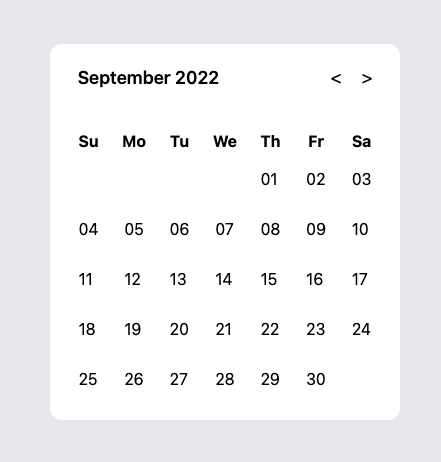

# 如何製作月曆 props【 calendar | 我不會寫 React Component 】

hashtags: `#react`, `#components`, `#accessibility`, `#calendar`, `#props`

本篇接續前篇 [如何製作月曆 compound components【 calendar | 我不會寫 React Component 】](./compound-components.md)  
可以先看完上一篇在接續此篇。

## Props with Typescript

為了讓元件能接收比較常見的基本 `props` 而不用明確的指定，  
我們通常會這樣做。

```jsx
function Component({ a, b, ...rest }) {
  return <something a={a} b={b} {...rest} />;
}
```

這樣做有好有壞，好的部分就不提了，來談談壞在哪。
壞的主要原因就是，
在缺乏文件的情況下，可傳入的 `props` 型別不明確導致使用者不清楚要怎麼使用。  
後面接手維護的人也會面臨到同樣情況，  
不清楚這個元件到底可以接收什麼。

```jsx
<Component a={/* what kind */} b={/* of props */} c={/* I need to pass */} />
```

但我又希望可以減少不必要的囉唆程式碼，  
這時 `typescript` 就起到了救場的作用。

```tsx
type ComponentProps = {
  a: string;
  b: string;
  c: "I";
  d: "pass";
};
function Component({ a, b, ...rest }) {
  return <something a={a} b={b} {...rest} />;
}

<Component a="now, I know" b="what kind of props should" c="I" d="pass" />;
```

很棒吧！他可以減少大量通靈的時間。

不過在你實作一段時間之後，  
又會牽扯到另一個問題，  
那就是不知道某些東西的型別怎麼訂，

以下討論 原生元件 的型別該怎麼訂。

## native element props type 原生元件的拋入型別

如果我們需要獲取跟延展原生元件的拋入型別，  
其中一個方式是透過： `React.ComponentProps`，`React.ComponentPropsWithRef` 或是 `React.ComponentPropsWithoutRef`。
(還有其他很多方法，這邊不討論這麼細。)

```tsx
type ButtonProps = React.ComponentProps<"button">;
type MyButtonProps = ButtonProps & {
  somethingElse: string;
};
function MyButton({ somethingElse, ...props }: MyButtonProps) {
  return <button {...props} />;
}
```

我會透過這個方式來延展日曆元件的傳入職。

```tsx
export type GridProps = ComponentProps<"table"> & {
  focus?: Date;
};
const Grid = (props: GridProps) => {
  let columnheader: ReturnType<typeof ColumnHeader> | null = null;
  let gridcell: ReturnType<typeof GridCell> | null = null;

  Children.forEach(props.children, (element) => {
    if (!isValidElement(element)) return;

    if (!columnheader && element.type === ColumnHeader) {
      columnheader = element;
    }
    if (!gridcell && element.type === GridCell) {
      gridcell = element;
    }
  });

  const context = useContext(CalendarContext);

  let { focus, ...rest } = props;
  focus = focus ?? context?.focus ?? new Date();

  const days = concat(
    repeat(undefined, getDay(startOfMonth(focus))),
    getDatesInMonth(focus)
  );

  const table = splitEvery(7, days);

  return (
    <Context.Provider value={{ focus, table }}>
      <table role="grid" {...rest}>
        <thead role="rowgroup">
          <tr role="row">{columnheader}</tr>
        </thead>
        <tbody>{gridcell}</tbody>
      </table>
    </Context.Provider>
  );
};
```

透過 `Omit` 可以濾出不要的型別。

```tsx
type _GridCellProps = {
  children?: (date: Date) => ReactNode;
};
export type GridCellProps = Omit<ComponentProps<"td">, keyof _GridCellProps> &
  _GridCellProps;
function GridCell(props: GridCellProps) {
  const context = useMonthCalendarContext(
    `<GridCell /> cannot be rendered outside <MonthCalendar />`
  );

  const { table, focus: focusOn } = context;

  return (
    <>
      {table.map((row, index) => (
        <tr key={index}>
          {row.map((day, index) => {
            if (!day) {
              return <td key={index} tabIndex={-1} />;
            }

            const element = props.children?.(day);
            const tabIndex = isSameDay(day, focus) ? 0 : -1;

            if (isValidElement(element)) {
              return (
                <td key={index}>
                  {cloneElement(element, { ...element.props, tabIndex })}
                </td>
              );
            }

            return (
              <td key={index} tabIndex={tabIndex}>
                {format(day, "dd")}
              </td>
            );
          })}
        </tr>
      ))}
    </>
  );
}
```

或是將 `Omit` 這個作為一個 `utility type` 抽出。

```tsx
import type { ComponentProps, ElementType } from "react";

export type ElementProps<E extends ElementType = ElementType, P = {}> = Omit<
  ComponentProps<E>,
  keyof P
> &
  P;

export type EP<E extends ElementType = ElementType, P = {}> = ElementProps<
  E,
  P
>;
```

```tsx
type _ColumnHeaderProps = {
  abbr?: (day: Date) => string;
  children?: (day: Date) => ReactNode;
};
type ColumnHeaderProps = EP<"th", _ColumnHeaderProps>;
function ColumnHeader(props: ColumnHeaderProps) {
  useMonthCalendarContext(
    `<ColumnHeader /> cannot be rendered outside <MonthCalendar />`
  );

  return (
    <>
      {range(0, 7)
        .map((days) => add(startOfWeek(new Date()), { days }))
        .map((day) => (
          <th
            {...props}
            abbr={props.abbr?.(day) ?? format(day, "EEEE")}
            children={props.children?.(day) ?? format(day, "EEEEEE")}
            key={day.toString()}
          />
        ))}
    </>
  );
}
```

## Polymorphic Components

因為有用到 [Polymorphic Components][polymorphic-components]，
事先做一個 utility type 會很有幫助。

```ts
import type { ComponentProps, ElementType } from "react";

export type ElementProps<E extends ElementType = ElementType, P = {}> = Omit<
  ComponentProps<E>,
  keyof P
> &
  P;

export type EP<E extends ElementType = ElementType, P = {}> = ElementProps<
  E,
  P
>;

type As<E extends ElementType = ElementType> = {
  as?: E;
};

export type PolymorphicComponentProps<
  E extends ElementType,
  P extends {}
> = As<E> & ElementProps<E, P>;

export type PCP<
  E extends ElementType,
  P extends {}
> = PolymorphicComponentProps<E, P>;
```

這種作法的好處是，可以由使用方決定要用哪一種 html element。  
像是下面 `Calendar` 可以是任何 html element，預設為 `div`。

```tsx
type _CalendarProps = { value?: Date };
export type CalendarProps<E extends ElementType = "div"> = PCP<
  E,
  _CalendarProps
>;
export function Calendar<E extends ElementType = "div">(
  props: CalendarProps<E>
) {
  const { value, as, ...rest } = props;

  const Comp = as ?? "div";

  const [focus, dispatch] = useReducer(reducer, value ?? new Date());
  useEffect(() => {
    const keydown = keymap(dispatch);

    window.addEventListener("keydown", keydown);
    return () => {
      window.removeEventListener("keydown", keydown);
    };
  }, [dispatch]);

  return (
    <Context.Provider value={{ focus, dispatch }}>
      <Comp {...rest} />
    </Context.Provider>
  );
}
```

```tsx
export type TitleProps<E extends ElementType> = PCP<E, {}>;
function Title<E extends ElementType>(props: TitleProps<E>) {
  const context = useCalendarContext(
    `<Calendar.Title /> cannot be rendered outside <Calendar />`
  );

  const { as, ...rest } = props;
  const Comp = as ?? "h2";
  const children = props.children ?? format(context.focus, "MMMM yyyy");

  return <Comp aria-live="polite" {...rest} children={children} />;
}
```

只鎖定 `button` 也行。

```tsx
type _ButtonProps = {
  action: Action;
};
export type ButtonProps = PCP<"button", _ButtonProps>;
function Button(props: ButtonProps) {
  const context = useCalendarContext(
    `<Calendar.Button /> cannot be rendered outside <Calendar />`
  );

  const { action, ...rest } = props;
  const onClick = (event: MouseEvent<HTMLButtonElement>) => {
    context.dispatch(action);
    props.onClick?.(event);
  };

  return (
    <button type="button" {...rest} onClick={onClick} aria-label={action}>
      {props.children}
    </button>
  );
}
```

## 樣式

我們不會在元件庫中實作樣式，  
因為我希望保持元件庫只封裝功能，或是一些較為基本的樣式，盡可能讓使用方可以自行客製化。



### 使用 [tailwindcss][https://tailwindcss.com/] 實作樣式

```tsx
<Calendar className="bg-white rounded-xl p-4 space-y-8">
  <Calendar.Header className="flex items-center">
    <Calendar.Title className="px-3 text-lg font-semibold" />

    <div className="flex ml-auto gap-3 items-center px-2">
      <Calendar.Button action="previous month" className="p-1 text-lg">
        {"<"}
      </Calendar.Button>
      <Calendar.Button action="next month" className="p-1 text-lg">
        {">"}
      </Calendar.Button>
    </div>
  </Calendar.Header>

  <MonthCalendar>
    <MonthCalendar.ColumnHeader />

    <MonthCalendar.GridCell>
      {(date) => <button className="p-3">{format(date, "dd")}</button>}
    </MonthCalendar.GridCell>
  </MonthCalendar>
</Calendar>
```

- [polymorphic-components]: https://react-typescript-cheatsheet.netlify.app/docs/advanced/patterns_by_usecase#polymorphic-components-eg-with-as-props
