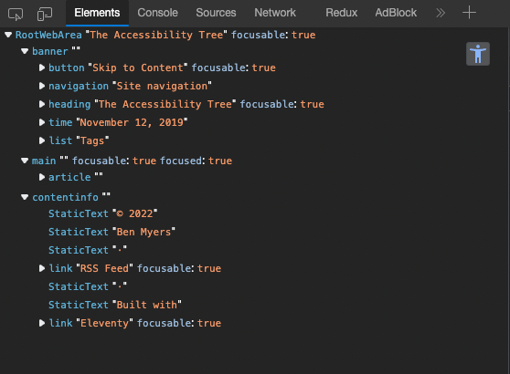

# 什麼是 Accessibility Tree 【 我不會寫 React Component 】

並不是每個用戶都擁有完整健全的身體。  
有些用戶他們需要借助像是 [螢幕閱讀器][vo]，[放大鏡][zeiss]，[眼動追蹤][tobii] 等輔助技術，  
才能有辦法使用網站服務。

可達性規格是很艱難的議題，  
不只是應用程序開發者，  
這其中也動員到包含規格設計者，硬體開發商，瀏覽器廠商，輔助器材商，法律等，  
耗費了很多年的時間，在 2016 年之後逐步成形的就是 _Accessibility Tree_。

這個樹狀結構描述了失能用戶會如何使用你的網站，  
作為一個開發者，我們有必要去了解我們的程式碼是如何建構這個樹狀結構。

在去年的 12 月，Chrome DevTool 也實裝了 _Accessibility Tree Inspector_，  
這個技術大幅減少我們的開發成本，  
讓我們不用在用耳朵一一確認 [VoiceOver][vo] 有沒有正確執行。

如果你有用過 [Testing Library][testing-library] 寫過單元測試，  
那你已經使用過 _Accessibility Tree_ 了。

## 基礎模型

### Accessible Object

Accessibility API 提供了一些基礎模型讓應用程序可以描述他們的內容，  
這個基礎模型被稱作 **accessible objects**。

他們附帶了一些屬性可以用來描述 UI 元素的功能性，  
並除去任何視覺跟美學的資訊。

舉例像是 `Checkbox` 物件：

```js
{
    name: "show tips on startup",
    checked: true,
    focusable: true,
    focused: false
}
```

或是像 `Button` 物件：

```js
{
    name: "submit",
    pressed: false,
    focusable: true,
    focused: true
}
```

這些基礎模型讓所有的應用程序可以用相同的方式描述他們的內容，  
透過這個規格，輔助科技開發商就不用在意用戶是使用 Microsoft Word 還是 web form。

而這些基礎模型也包含了一些關於 UI 的重要資訊，接著往下看。

### 3 個重要的 UI 資訊

- **Role**
  用來表示這個元素是什麼。  
  它是 _text_ 還是 _button_ 還是 _checkbox_？  
  這個資訊非常重要，她用於表示 **為什麼這個元素會在這**，**要如何跟這個元素互動**，**當你跟他互動時會發生什麼**。

- **Name**
  這個元素的標籤或是識別子被稱作 **accessible name**。  
  例如，`button` 會使用他們的文字內容作為區分它們的名稱，  
  像是 `<button>Submit</button>` 的名稱就是 `Submit`。  
  通常 `form` 裡面的輸入欄位都必須要附帶 `<label>` 元素，  
  並使用 `<label>` 元素作為名稱。
  螢幕閱讀器會告知用戶這個名稱來表示該元件，  
  使用語音控制的用戶也可以透過這個名稱來對應特定元素。

- **State**
  其他用戶也需要關切的屬性，像是，  
  `checkbox` 當前狀態是 `checked` 還是 `unchecked`，  
  這個可展開的段落目前是 `hidden` 的嗎，  
  按下這個按鈕是否會打開下拉選單。
  這些會根據元素的 **Role** 跟 **Name** 而有不同的屬性。

## 從 DOM 到 Accessibility Tree

前端工程師應該都知道[渲染流程][renderingng] (次世代選染模型)，  
但比較少知道除了會產生 [DOM Tree][dom] 之外，  
還會把你的 html 轉換成 _Accessibility Tree_，  
包含頁面更新，都會對應產生一組新的。

瀏覽器廠商遵循一個標準規格來實作，  
將 html 轉換成 _Accessibility Tree_，  
那套規格就是 [Core-AAM][core-aam]

[Core-AAM][core-aam] 提供了一系列的指南，  
告訴開發者如何使用基礎模型，  
同時也建議如何計算出模型名稱，如何管理狀態或是鍵盤導航。

DOM Node 跟 Accessibility Tree Node 並非是 1 對 1 對應關係，  
有些 Node 會被拿掉，像是 `<div>` 或是 `<span>`，這些只有 styling 作用的 Node。  
像是 `<video>` 這類的元素，可能會展開成多個 Node，  
因為 video player 明顯複雜許多，  
他需要多個控制像是 Play/Pause 按鈕，progress bar，全螢幕按鈕。

現在的瀏覽器應該都有實裝了 _Accessibility Tree Inspector_，  
打開 Chrome DevTool，在 Elements 底下的 tabs 找找看有沒有 Accessibility。  
或是新版會有個按鈕直接將整個 html 轉換成 Accessibility Tree。



## 關聯閱讀

[The Accessibility Tree](https://benmyers.dev/blog/accessibility-tree/#fn-ref-1)

## 名詞對照

| 中文     | 英文                   |
| -------- | ---------------------- |
| 輔助科技 | assistive technologies |

[vo]: https://www.apple.com/accessibility/vision/
[zeiss]: https://www.zeiss.com.sg/vision-care/eye-care-professionals/other-products/magnifying-visual-devices/magnifiers.html
[tobii]: https://www.tobii.com/group/about/this-is-eye-tracking/
[testing-library]: https://testing-library.com/
[renderingng]: https://developer.chrome.com/articles/renderingng/
[dom]: https://en.wikipedia.org/wiki/Document_Object_Model
[core-aam]: https://www.w3.org/TR/core-aam-1.1/
