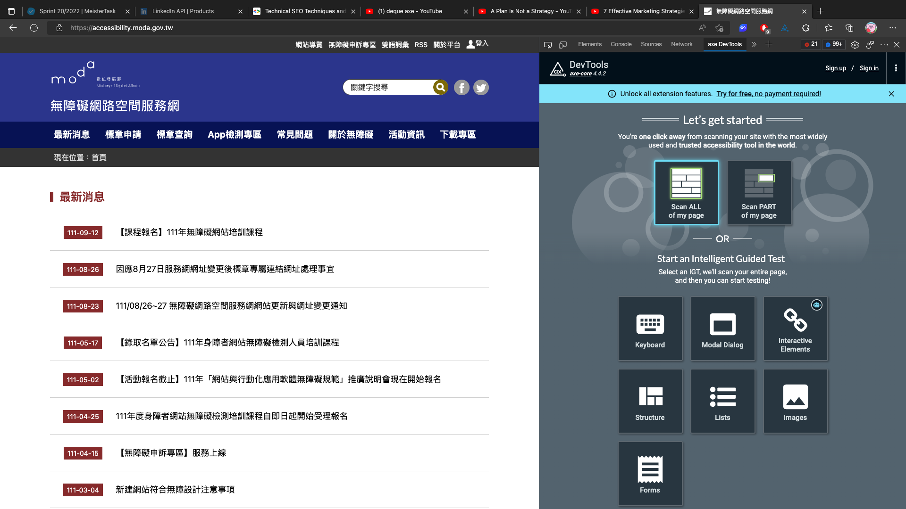
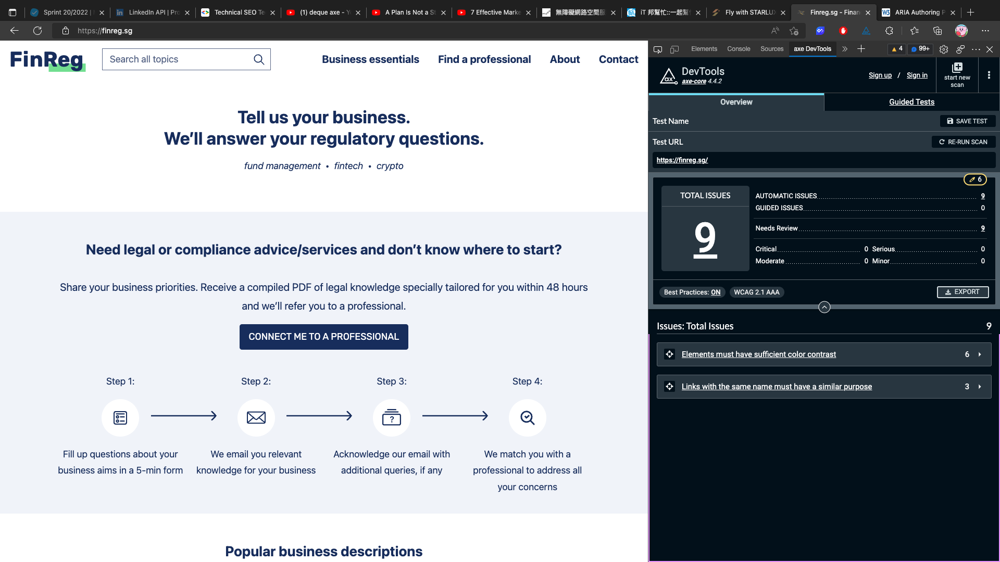

# 如何導入 deque axe 【 我不會寫 React Component 】

> 台灣的無障礙規範 聲稱自己參照 w3c 規範，  
> 但還是有太多地方跟國際規範不同。
> 先不論是政治還是官僚等無聊原因，
> 考慮到讀者未來發展性，筆者鼓勵盡量走國際規範，
> 以下僅介紹 國際規範 的驗證技術。

## 什麼是 deque axe

你可以把 [deque] 當成是可達性驗證的權威機構，  
提供 WCAG 相關的訓練跟稽核等等。

其中 [axe] 是他們的標準測試工具，  
你可以當它像是台灣的 Freego，  
但好用很多，等等用過 [axe] 就知道了。

## 試試 axe chrome extension

最簡單體驗 [axe] 測試的方式就是透過 [axe chrome extension][axe]，
完全免費，而且抓得非常嚴謹。


## 驗一些網站看看

讓我們先來驗看看 [數位發展部 無障礙網路空間服務網](accessibility-tw)，  
進入到的[首頁](accessibility-tw)後，  
打開 Devtool，應該會看到 axe Devtool 在上方的 tabs。


選擇掃描頁面上所有元素。



驗證結果有 15 項 issues。


只有 15 項，已經非常厲害了。  
我們可以用 [it 邦首頁](ithelp) 來做的對比 (抱歉囉！IT 邦～)。


超過 100 項，基本上就是網站要重寫了。

[wai 規範][apg] 畢竟是規範制定者，自己當然不能漏氣。


這邊也附上筆者自己參與過的專案。




## 優化

得到了 report 之後就是要優化，  
我們來研究一下 [數位發展部 無障礙網路空間服務網](accessibility-tw) 的報告。

唯一一項要特別講的就是，這邊有個 serious 等級的問題。


這邊可以看到 `input` 雖然有 `title` 但卻缺少了 `label`，  
它們似乎搞混了 `title` 跟 `label` 的使用方式，  
這裡點擊 [More info](https://dequeuniversity.com/rules/axe/4.4/label-title-only?application=AxeChrome)
就可以看到詳細的說明。

這邊簡單總結一下，  
`title` 跟 `aria-describedby` 是用來提供用戶額外資訊的，  
而 `label` 跟 `aria-label`, `aria-labelledby` 這些才是真正提供的 Accessibility Name 的關鍵屬性，  
沒有 Accessibility Name 是很低級的錯誤。

> 關於什麼是 Accessibility Name，詳細可見
> [什麼是 Accessibility Tree 【 我不會寫 React Component 】](./misc/accessibility-tree.md)。

## 單元測試

但這次主要並非偏向應用而是函式庫，  
所以上面的 Chrome extension 沒辦法整合進我的測試，  
我們需要其他方案。

所幸 [deque] 開源了 [axe-core]，它是 [deque] 背後使用的驗證工具。  
但我們會用他的高階封裝 [vitest-axe]。

在根目錄執行

```bash
yarn add -D -W vitest-axe
```

我們用 Calendar 作為例子，詳見 [integration]。

```tsx
import { axe } from "vitest-axe";

const setup = () => {
  userEvent.setup();
  const { container } = render(
    <Calendar value={new Date(0)}>
      <Calendar.Header>
        <Calendar.Button action="previous year">{"<<"}</Calendar.Button>
        <Calendar.Button action="previous month">{"<"}</Calendar.Button>

        <Calendar.Title />

        <Calendar.Button action="next month">{">"}</Calendar.Button>
        <Calendar.Button action="next year">{">>"}</Calendar.Button>
      </Calendar.Header>

      <MonthCalendar.Grid>
        <MonthCalendar.ColumnHeader />

        <MonthCalendar.GridCell />
      </MonthCalendar.Grid>
    </Calendar>
  );

  return () => axe(container);
};

it("when click previous/next month, should change the month and year displayed in the calendar", async () => {
  const axe = setup();

  const nextMonth = screen.getByRole("button", { name: /next month/ });
  const prevMonth = screen.getByRole("button", { name: /previous month/ });
  const nextYear = screen.getByRole("button", { name: /next year/ });
  const prevYear = screen.getByRole("button", { name: /previous year/ });

  expect(screen.getAllByRole(/(grid)?cell/).at(4)).toHaveTextContent("01");
  expect(screen.getAllByRole(/(grid)?cell/).at(-1)).toHaveTextContent("31");
  expect(screen.getByRole("heading")).toHaveTextContent("January 1970");
  expect(await axe()).toHaveNoViolations();

  await userEvent.click(nextMonth);
  expect(screen.getAllByRole(/(grid)?cell/).at(0)).toHaveTextContent("01");
  expect(screen.getAllByRole(/(grid)?cell/).at(-1)).toHaveTextContent("28");
  expect(screen.getByRole("heading")).toHaveTextContent("February 1970");
  expect(await axe()).toHaveNoViolations();

  await userEvent.click(prevMonth);
  expect(screen.getAllByRole(/(grid)?cell/).at(4)).toHaveTextContent("01");
  expect(screen.getAllByRole(/(grid)?cell/).at(-1)).toHaveTextContent("31");
  expect(screen.getByRole("heading")).toHaveTextContent("January 1970");
  expect(await axe()).toHaveNoViolations();

  await userEvent.click(nextYear);
  expect(screen.getAllByRole(/(grid)?cell/).at(5)).toHaveTextContent("01");
  expect(screen.getAllByRole(/(grid)?cell/).at(-1)).toHaveTextContent("31");
  expect(screen.getByRole("heading")).toHaveTextContent("January 1971");
  expect(await axe()).toHaveNoViolations();

  await userEvent.click(prevYear);
  expect(screen.getAllByRole(/(grid)?cell/).at(4)).toHaveTextContent("01");
  expect(screen.getAllByRole(/(grid)?cell/).at(-1)).toHaveTextContent("31");
  expect(screen.getByRole("heading")).toHaveTextContent("January 1970");
  expect(await axe()).toHaveNoViolations();
});
```

## 備註

雖然有 [axe]，  
但個人建議還是要對照標準規格自行撰寫測試，  
[axe] 只能算是多一個驗證輔助，  
最終還是自己親手寫的測試才是最穩健的。

[accessibility-tw]: https://accessibility.moda.gov.tw/
[ithelp]: https://ithelp.ithome.com.tw/
[apg]: https://www.w3.org/WAI/ARIA/apg/
[axe]: https://www.deque.com/axe/
[deque]: https://www.deque.com/
[axe-core]: https://github.com/dequelabs/axe-core
[vitest-axe]: https://github.com/chaance/vitest-axe
[integration]: https://github.com/kayac-chang/react-wai/blob/main/packages/calendar/__tests__/Integration.test.tsx
