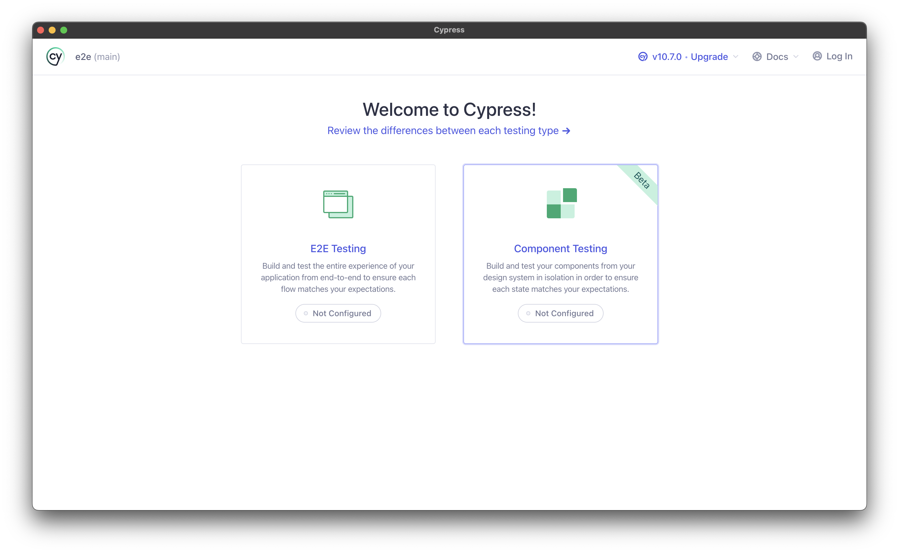
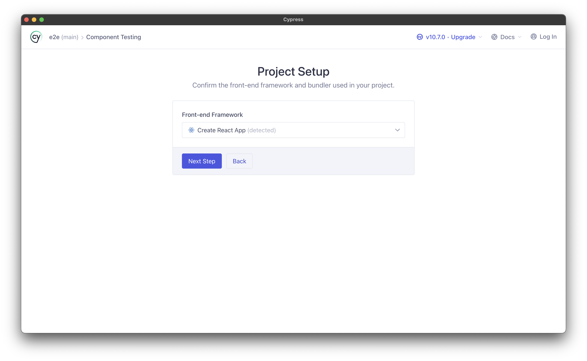
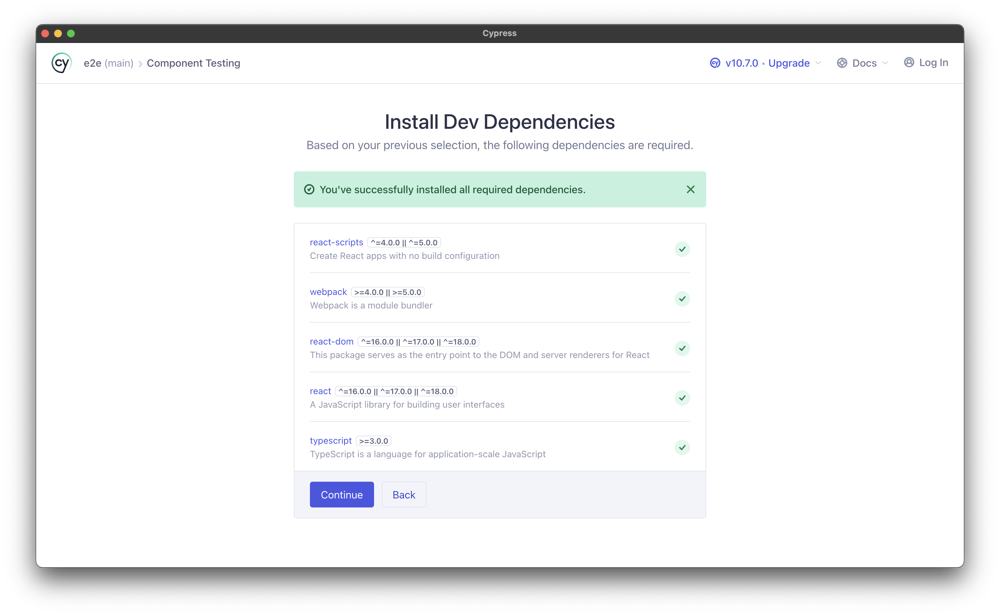
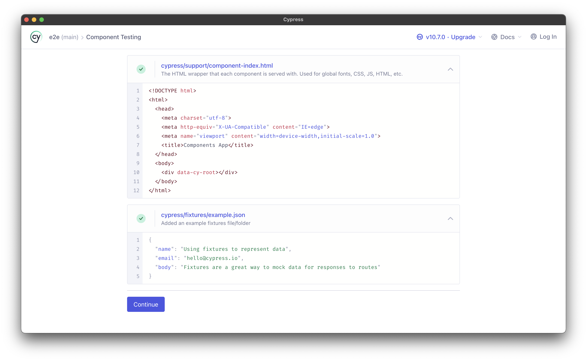
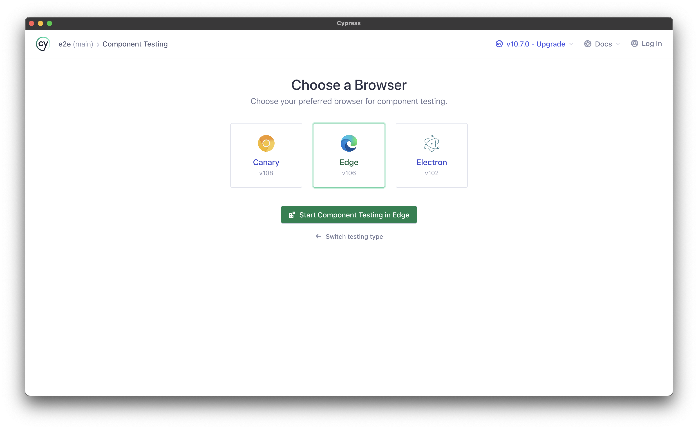
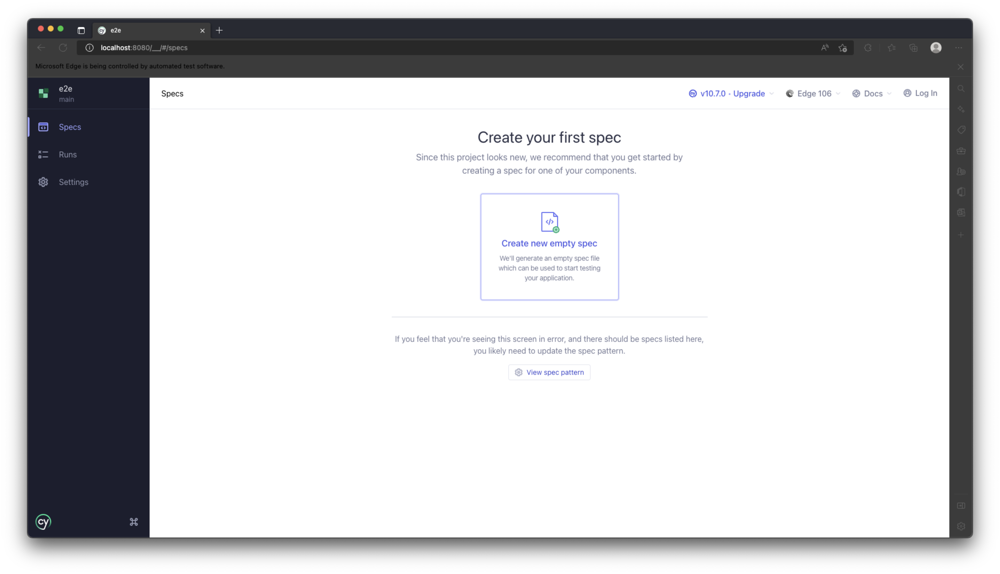
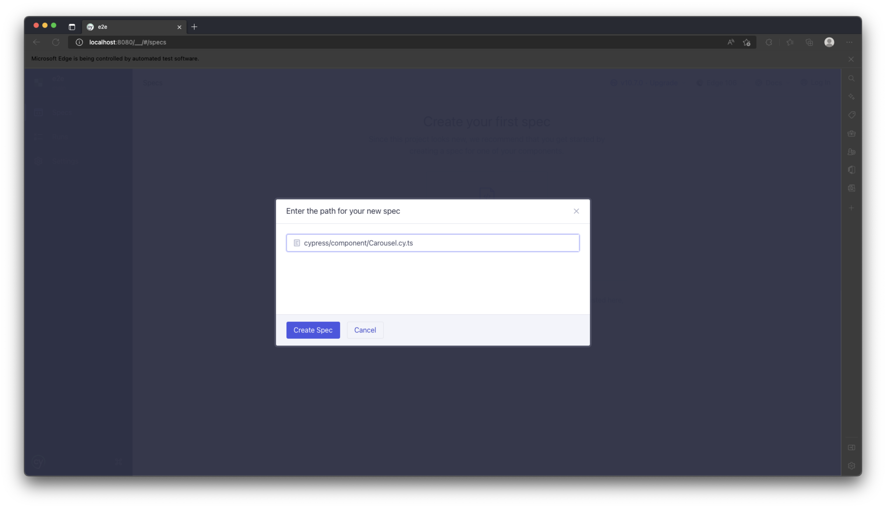
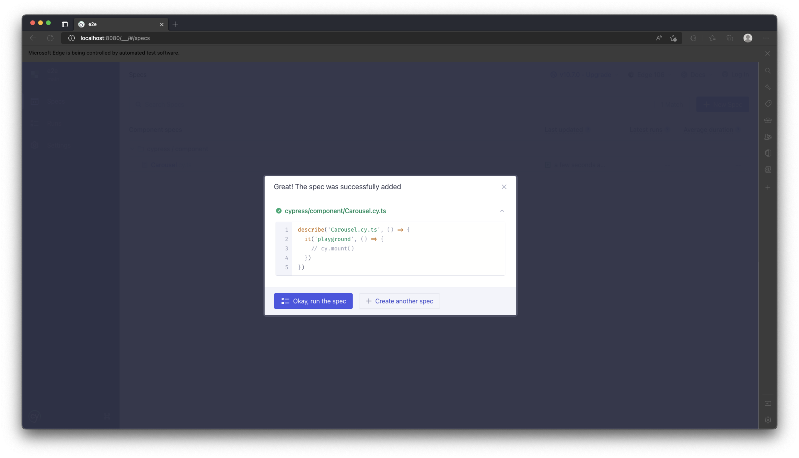
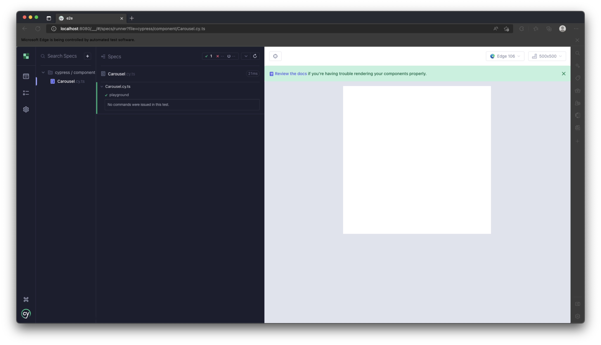
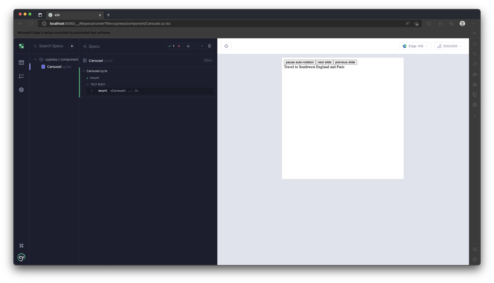

## 如何導入 cypress 【 我不會寫 React Component 】

因為這邊開發的是 Component，所以這次會用 [Cypress Component Testing][component-testing]。

## Setup

設置專案在 `apps/` 底下。

E2E 專案 可以放在對應 application 專案底下 或是 像這次是獨立放，  
端看團隊習慣。

```bash
# move to apps/ folder
cd apps

# create new folder call e2e/ for end-to-end testing
mkdir e2e && cd $_

# init project
yarn init -y
```

- `package.json`

```json
{
  "name": "e2e",
  "version": "0.0.0",
  "private": true,
  "devDependencies": {
    "carousel": "*",
    "tsconfig": "*",
    "cypress": "latest",
    "react-scripts": "latest",
    "ts-loader": "latest",
    "typescript": "latest",
    "webpack": "latest"
  },
  "browserslist": "defaults"
}
```

- `tsconfig.json`

```json
{
  "extends": "tsconfig/nextjs.json",
  "compilerOptions": {
    "types": ["cypress", "node"]
  },
  "include": ["."]
}
```

接著，執行 `cypress`。

```bash
yarn cypress open
```

選擇測試的項目。


選擇框架類型。


[cypress] 會幫你配置需要安裝的套件。


自動生成基礎配置。


選擇測試的瀏覽器。


建立空的規格。


我們用 [carousel] 來進行測試。


開啟規格。


看到這樣就表示成功運行規格了。


## Mount

使用 [turborepo] 時，標注 `"*"` 的套件表示是內部套件，  
內部套件可以直接使用 typescript，  
但在 [cypress] 沒辦法直接編譯，  
我們要用 [webpack] 幫我們處理 ts 編譯的部分。

- `webpack.config.ts`

```js
export default {
  module: {
    rules: [
      {
        test: /\.tsx?$/,
        use: "ts-loader",
        exclude: /node_modules/,
      },
    ],
  },
  resolve: {
    extensions: [".tsx", ".ts", ".js"],
  },
};
```

- `cypress.config.ts`

```ts
import { defineConfig } from "cypress";
import webpackConfig from "./webpack.config";

export default defineConfig({
  component: {
    devServer: {
      framework: "create-react-app",
      bundler: "webpack",
      webpackConfig,
    },
  },
});
```

接著，我們試著運行 [carousel] 試試看。

- `Carousel.cy.tsx`

```tsx
import { Carousel } from "carousel";

describe("Carousel.cy.ts", () => {
  it("mount", () => {
    cy.mount(
      <Carousel aria-label="Highlighted television shows" interval={10_000}>
        <Carousel.Button action="toggle">
          {(auto_rotation) =>
            auto_rotation ? "pause auto-rotation" : "start auto-rotation"
          }
        </Carousel.Button>
        <Carousel.Button action="next">next slide</Carousel.Button>
        <Carousel.Button action="prev">previous slide</Carousel.Button>
        <Carousel.Items>
          <Carousel.Item>
            Dynamic Europe: Amsterdam, Prague, Berlin
          </Carousel.Item>
          <Carousel.Item>Travel to Southwest England and Paris</Carousel.Item>
          <Carousel.Item>
            Great Children's Programming on Public TV
          </Carousel.Item>
          <Carousel.Item>Foyle’s War Revisited</Carousel.Item>
          <Carousel.Item>Great Britain Vote: 7 pm Sat.</Carousel.Item>
          <Carousel.Item>
            Mid-American Gardener: Thursdays at 7 pm
          </Carousel.Item>
        </Carousel.Items>
      </Carousel>
    );
  });
});
```



[cypress]: https://docs.cypress.io/
[component-testing]: https://docs.cypress.io/guides/component-testing/devs-vs-users
[carousel]: https://ithelp.ithome.com.tw/articles/10304457
[turborepo]: https://turborepo.org/
[webpack]: https://webpack.js.org/
